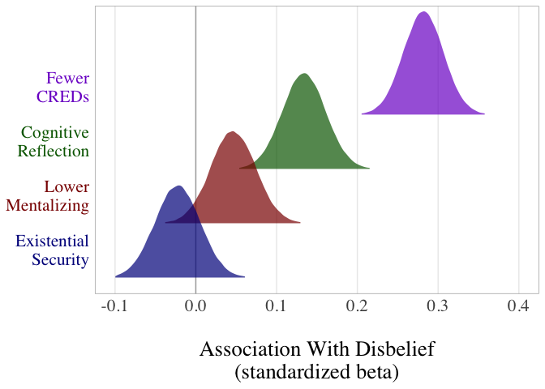
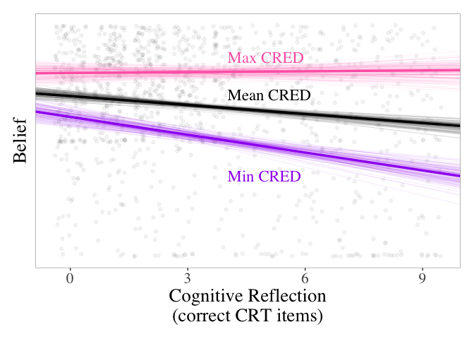
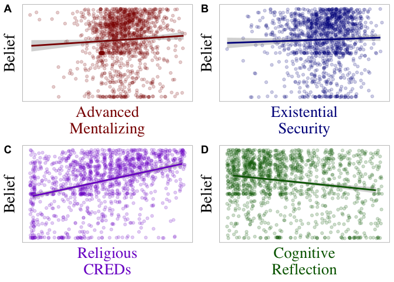

## Some Background Shit

Religion is a core component of human nature, yet a comprehensive scientific account of religion also needs to account for religious disbelief. Despite potentially drastic overreporting of religiosity, a third of the world’s 7 billion human inhabitants may actually be atheists—merely people who do not believe in God or gods. The origins of disbelief thus present a key testing ground for theories of religion. Here, we evaluate the predictions of four theoretical approaches to the origins of disbelief.

To currently believe in a god, one 1) must be able to mentally represent gods, 2) must be motivated to ‘interact’ with gods, 3) must receive credible cultural cues that some gods are real, and 4) must intuitively maintain this belief over time. Tweaks to any of these four components may instead yield disbelief in gods. Separate lines of research partially support this supposition. First, individual differences in mentalizing abilities (one key component of mind perception) predict religious disbelief in at least some samples. Second, although religion flourishes where life is unstable, existential security predicts reduced religiosity. Third, lack of credibility enhancing displays (CREDs) that one ought to believe in any gods is a good global predictor of atheism. Finally, people who reflectively override their intuitions tend to be less religious than those who ‘go with their guts’, although the magnitude and consistency of this relation is debatable. Although these four factors relate to religious disbelief in isolation, little work considers their operation in conjunction.

Different theoretical approaches make divergent predictions about which of these four factors are the most potent predictors of religious disbelief. First, secularization models posit that increases in existential security (wealth, health, education) reduce religious motivation; this approach is common in sociology of religion and in social psychology, under the banner of compensatory control. Second, evolutionary psychology and cognitive science of religion often view religion as a cognitive byproduct of other mental adaptations, such as mind perception or predator detection. In this view, challenges in the core cognitive faculties underlying such adaptations (e.g., mentalizing) would predict disbelief, as would people being able to override their religious intuitions via cognitive reflection. Third, cultural evolutionary models highlight the social learning processes underpinning religious belief and disbelief, and largely predict that context-biased social learning such as CREDs would be strongly associated with degrees of religious belief. Finally, dual inheritance models somewhat integrate these various perspectives, and predict that CREDs would be most important, followed by other factors such as cognitive reflection, mentalizing, and existential security. Table 1 depicts predictions derived from each of these perspectives. By simultaneously considering mentalizing, existential security, CREDs, and cognitive reflection, we are able to evaluate the suitability of each of these four theoretical approaches for understanding the psychological origins of religious disbelief.

<table class="table table-striped" style="width: auto !important; ">
 <thead>
<tr>
<th style="border-bottom:hidden" colspan="2"></th>
<th style="border-bottom:hidden; padding-bottom:0; padding-left:3px;padding-right:3px;text-align: center; " colspan="4">
What Predicts Disbelief?
</th>
</tr>
  <tr>
   <th style="text-align:left;"> Theory </th>
   <th style="text-align:left;"> Discipline </th>
   <th style="text-align:left;"> Low.Mentalizing </th>
   <th style="text-align:left;"> High.Security </th>
   <th style="text-align:left;"> Low.CREDs </th>
   <th style="text-align:left;"> High.Reflection </th>
  </tr>
 </thead>
<tbody>
  <tr>
   <td style="text-align:left;font-weight: bold;"> Secularization </td>
   <td style="text-align:left;"> Sociology &amp; Social Psych </td>
   <td style="text-align:left;">  </td>
   <td style="text-align:left;"> STRONG </td>
   <td style="text-align:left;">  </td>
   <td style="text-align:left;">  </td>
  </tr>
  <tr>
   <td style="text-align:left;font-weight: bold;"> Cognitive Byproduct </td>
   <td style="text-align:left;"> Ev Psych &amp; Cog Sci Rel </td>
   <td style="text-align:left;"> medium </td>
   <td style="text-align:left;"> weak </td>
   <td style="text-align:left;">  </td>
   <td style="text-align:left;"> Strong </td>
  </tr>
  <tr>
   <td style="text-align:left;font-weight: bold;"> Social Learning </td>
   <td style="text-align:left;"> Cultural Evolution </td>
   <td style="text-align:left;">  </td>
   <td style="text-align:left;">  </td>
   <td style="text-align:left;"> STRONG </td>
   <td style="text-align:left;">  </td>
  </tr>
  <tr>
   <td style="text-align:left;font-weight: bold;"> Dual Inheritance </td>
   <td style="text-align:left;"> Gene-Culture Coevolution </td>
   <td style="text-align:left;"> weak </td>
   <td style="text-align:left;"> indirect </td>
   <td style="text-align:left;"> STRONG </td>
   <td style="text-align:left;"> weak </td>
  </tr>
</tbody>
</table>

## Really Basic Methods

We preregistered a set of analyses that pit secularization, cognitive byproduct, socialization, and dual inheritance models against each other. Specifically, we posed three broad questions:

***I.	What are the relative contributions of each factor when considered simultaneously?***

***II.	How do the factors interact with each other in predicting belief and disbelief?***

***III.	Does early work on each individual factor successfully replicate in a nationally representative sample?***

To approach these questions, we contracted a nationally representative sample of USA adults (N= 1417) from GfK. Primarily, we were interested in predicting degrees of religious belief and disbelief with measures of 1) advanced mentalizing, 2) existential security, 3) theoretically modeled cues of cultural exposure to credible cues of religiosity (CREDs), and 4) intuitive versus reflective cognitive style. For robustness, we also included a number of demographic and psychological covariates.

<table class="table table-striped" style="width: auto !important; float: right; margin-left: 10px;">
 <thead>
  <tr>
   <th style="text-align:left;"> Variable </th>
   <th style="text-align:right;"> Beta </th>
   <th style="text-align:left;"> HPDI </th>
   <th style="text-align:left;"> Pr </th>
  </tr>
 </thead>
<tbody>
  <tr>
   <td style="text-align:left;font-weight: bold;"> Low Mentalizing </td>
   <td style="text-align:right;"> 0.05 </td>
   <td style="text-align:left;"> [-0.01, 0.11] </td>
   <td style="text-align:left;"> 0.95 </td>
  </tr>
  <tr>
   <td style="text-align:left;font-weight: bold;"> Mentalizing (quad) </td>
   <td style="text-align:right;"> 0.01 </td>
   <td style="text-align:left;"> [-0.02, 0.04] </td>
   <td style="text-align:left;"> 0.81 </td>
  </tr>
  <tr>
   <td style="text-align:left;font-weight: bold;"> Security </td>
   <td style="text-align:right;"> -0.02 </td>
   <td style="text-align:left;"> [-0.08, 0.04] </td>
   <td style="text-align:left;"> 0.21 </td>
  </tr>
  <tr>
   <td style="text-align:left;font-weight: bold;"> Low CREDs </td>
   <td style="text-align:right;"> 0.28 </td>
   <td style="text-align:left;"> [0.23, 0.34] </td>
   <td style="text-align:left;"> &gt; 0.99 </td>
  </tr>
  <tr>
   <td style="text-align:left;font-weight: bold;"> Reflection </td>
   <td style="text-align:right;"> 0.13 </td>
   <td style="text-align:left;"> [0.08, 0.19] </td>
   <td style="text-align:left;"> &gt; 0.99 </td>
  </tr>
  <tr>
   <td style="text-align:left;font-weight: bold;"> Age </td>
   <td style="text-align:right;"> 0.01 </td>
   <td style="text-align:left;"> [-0.04, 0.07] </td>
   <td style="text-align:left;"> 0.69 </td>
  </tr>
  <tr>
   <td style="text-align:left;font-weight: bold;"> Education </td>
   <td style="text-align:right;"> 0.04 </td>
   <td style="text-align:left;"> [-0.02, 0.1] </td>
   <td style="text-align:left;"> 0.92 </td>
  </tr>
  <tr>
   <td style="text-align:left;font-weight: bold;"> Male </td>
   <td style="text-align:right;"> 0.07 </td>
   <td style="text-align:left;"> [0.02, 0.13] </td>
   <td style="text-align:left;"> &gt; 0.99 </td>
  </tr>
  <tr>
   <td style="text-align:left;font-weight: bold;"> Social Lib </td>
   <td style="text-align:right;"> 0.43 </td>
   <td style="text-align:left;"> [0.35, 0.52] </td>
   <td style="text-align:left;"> &gt; 0.99 </td>
  </tr>
  <tr>
   <td style="text-align:left;font-weight: bold;"> Economic Cons </td>
   <td style="text-align:right;"> 0.04 </td>
   <td style="text-align:left;"> [-0.05, 0.12] </td>
   <td style="text-align:left;"> 0.82 </td>
  </tr>
  <tr>
   <td style="text-align:left;font-weight: bold;"> Extraversion </td>
   <td style="text-align:right;"> 0.02 </td>
   <td style="text-align:left;"> [-0.03, 0.08] </td>
   <td style="text-align:left;"> 0.82 </td>
  </tr>
  <tr>
   <td style="text-align:left;font-weight: bold;"> Conscientiousness </td>
   <td style="text-align:right;"> 0.01 </td>
   <td style="text-align:left;"> [-0.04, 0.07] </td>
   <td style="text-align:left;"> 0.71 </td>
  </tr>
  <tr>
   <td style="text-align:left;font-weight: bold;"> Neuroticism </td>
   <td style="text-align:right;"> 0.00 </td>
   <td style="text-align:left;"> [-0.06, 0.07] </td>
   <td style="text-align:left;"> 0.56 </td>
  </tr>
  <tr>
   <td style="text-align:left;font-weight: bold;"> Low Agreeableness </td>
   <td style="text-align:right;"> 0.10 </td>
   <td style="text-align:left;"> [0.04, 0.17] </td>
   <td style="text-align:left;"> &gt; 0.99 </td>
  </tr>
  <tr>
   <td style="text-align:left;font-weight: bold;"> Openness </td>
   <td style="text-align:right;"> 0.07 </td>
   <td style="text-align:left;"> [0.01, 0.13] </td>
   <td style="text-align:left;"> &gt; 0.99 </td>
  </tr>
  <tr>
   <td style="text-align:left;font-weight: bold;"> Honesty/Humility </td>
   <td style="text-align:right;"> 0.04 </td>
   <td style="text-align:left;"> [-0.02, 0.1] </td>
   <td style="text-align:left;"> 0.91 </td>
  </tr>
</tbody>
<tfoot>
<tr><td style="padding: 0; border: 0;" colspan="100%">Note: </td></tr>
<tr><td style="padding: 0; border: 0;" colspan="100%">
 Standardized betas for each variable predicting disbelief. </td></tr>
<tr><td style="padding: 0; border: 0;" colspan="100%">
1 HPDI = 97% highest posterior density interval; </td></tr>
<tr><td style="padding: 0; border: 0;" colspan="100%">
2 Pr = probability of beta being greater than zero</td></tr>
</tfoot>
</table>
## Quick Results Summary

### Relative Contributions

Our most important analyses considered the relative contributions of all four factors operating in concert. As preregistered, we report two analyses in which the four core factors predict individual differences in belief and disbelief, both in the presence and absence of additional covariates. In our full model (see Table 2 and Figure 1), few credible displays of faith proved to be by far the most powerful predictor of religious disbelief. Credibility enhancing displays of faith predict belief, and their absence predicts atheism. Cognitive reflection remained a consistent predictor of religious disbelief, but following earlier cross-cultural work its predictive power was quite meager. Mentalizing challenges were only weakly associated, if at all, with disbelief, and existential security predicted essentially nothing.

<!-- -->

***Figure 1:*** Posterior densities for how well each factor predicts religious disbelief (standardized beta).

### Planned Interactions

Next, we probed for interactions between the four factors. Results suggest an interaction between cultural learning and reflective cognitive style . We broke down this interaction in two different ways. First, we considered the association between disbelief and reflective cognitive style among those comparatively high and low on credible cultural cues of religious belief (Figure 2a). Reflective cognitive style primarily predicts religious disbelief among those who were also comparatively low in cultural exposure to credible religious cues of faith. Second, we predicted current religious belief from cultural exposure to credibility enhancing displays of religion and then correlated reflective cognitive style with the residual. Effectively, this analysis suggests that reflective thinkers tend to be less religious than one would assume based solely on their cultural exposure to religious cues (Figure 2b). It is thus possible that reflective cognitive style is one mechanism that leads people to lose faith over time ##; in contrast, an intuitive cognitive style leads people to adhere to their early cultural inputs and perhaps become more religious in some contexts. These patterns highlight the interactive roles of cultural context and evolved intuitions on religious cognition, as predicted by dual inheritance theories.

<!-- -->

***Figure 2:*** Interaction between CREDs and Cognitive Reflection

<table class="table table-striped" style="width: auto !important; float: right; margin-left: 10px;">
 <thead>
  <tr>
   <th style="text-align:left;"> Variable </th>
   <th style="text-align:right;"> r </th>
   <th style="text-align:left;"> HPDI </th>
   <th style="text-align:left;"> Pr </th>
  </tr>
 </thead>
<tbody>
  <tr>
   <td style="text-align:left;font-weight: bold;"> Low Mentalizing </td>
   <td style="text-align:right;"> 0.06 </td>
   <td style="text-align:left;"> [0, 0.12] </td>
   <td style="text-align:left;"> 0.98 </td>
  </tr>
  <tr>
   <td style="text-align:left;font-weight: bold;"> Mentalizing (quad) </td>
   <td style="text-align:right;"> 0.02 </td>
   <td style="text-align:left;"> [-0.02, 0.06] </td>
   <td style="text-align:left;"> 0.89 </td>
  </tr>
  <tr>
   <td style="text-align:left;font-weight: bold;"> High Security </td>
   <td style="text-align:right;"> -0.03 </td>
   <td style="text-align:left;"> [-0.09, 0.02] </td>
   <td style="text-align:left;"> 0.1 </td>
  </tr>
  <tr>
   <td style="text-align:left;font-weight: bold;"> Low CREDs </td>
   <td style="text-align:right;"> 0.38 </td>
   <td style="text-align:left;"> [0.32, 0.43] </td>
   <td style="text-align:left;"> &gt;0.99 </td>
  </tr>
  <tr>
   <td style="text-align:left;font-weight: bold;"> High Reflection </td>
   <td style="text-align:right;"> 0.18 </td>
   <td style="text-align:left;"> [0.12, 0.24] </td>
   <td style="text-align:left;"> &gt;0.99 </td>
  </tr>
</tbody>
</table>

### Individual Replications

Finally, we tested each candidate factor in isolation, merely to replicate previous work. In individual zero-order replication analyses (Table 3), only cultural learning and reflective cognitive style emerged as consistent predictors of religious disbelief. That two of the candidate factors culled from existing literature did not appear as robust predictors in these models may suggest tempered enthusiasm for their utility as predictors of individual differences in religiosity more broadly, although they both (especially existential security) may still be useful in analyzing larger-scale regional and international trends.

<!-- -->
